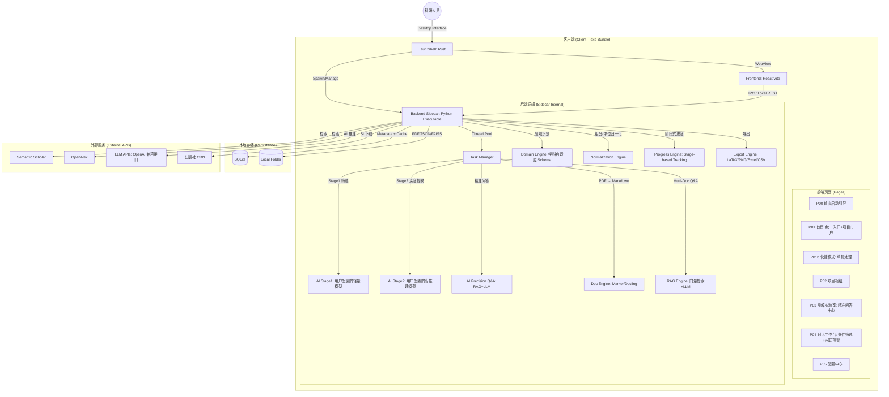
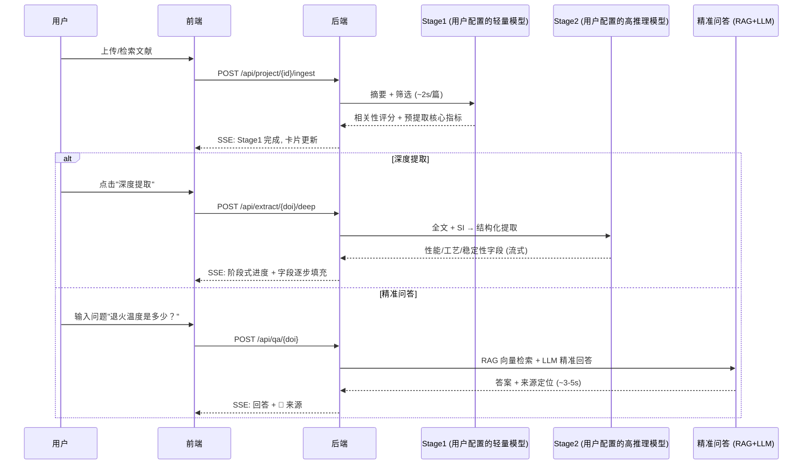
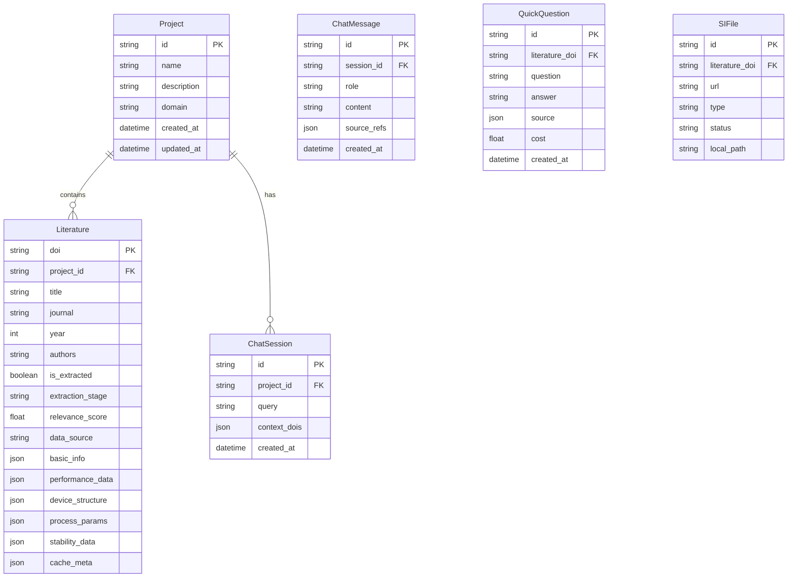
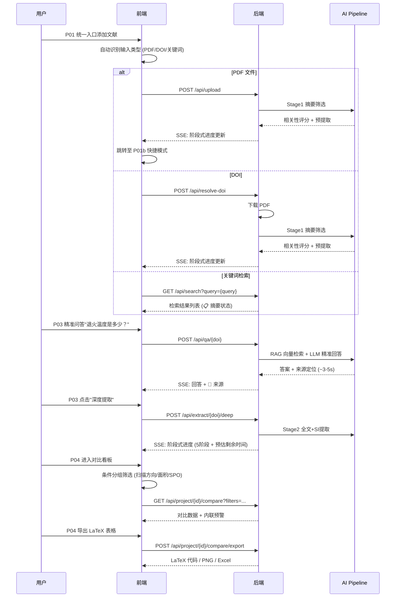
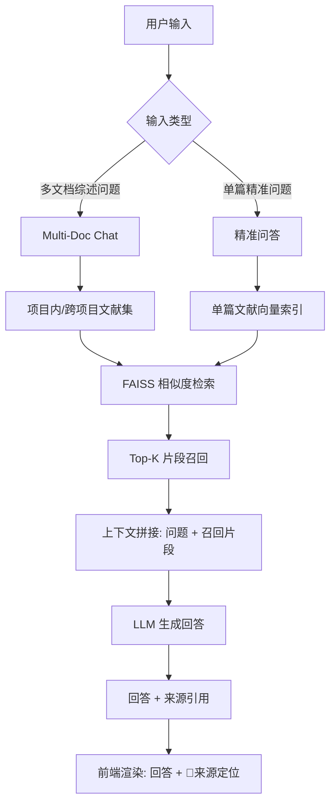

# 系统架构设计文档 (System Architecture)

**项目名称**：Sci-Insight Agent (SIA) / 理工科科研综合分析查询助手
**文档版本**：V2.1
**依据 PRD 版本**：V2.1
**日期**：2026-05-10

---

## 1. 架构总览 (High-Level Architecture)

SIA 采用 **Tauri + Python Sidecar** 的混合架构，以**任务驱动、按需提取**为核心交互模型，支持跨学科（STEM）文献的智能分析与多文档问答。

> **V2.1 核心设计理念**：以科研人员任务为中心，而非以系统功能为中心——有文献就先用（项目是事后组织工具），按需精准回答问题（想问什么就提取什么），统一添加文献入口（系统自动识别输入类型）。



### 1.1 架构核心变更（V1.0 → V2.0）

| 变更维度 | V1.0 | V2.0 | 变更驱动 |
|---------|------|------|---------|
| 产品定位 | 钙钛矿专用工具 (PIA) | STEM 全领域科研助手 (SIA) | PRD V2.0 战略升级 |
| 工作流驱动 | 检索驱动 (Search-first) | 项目+上传驱动 (Project & Upload-first) | 用户场景深化 |
| 页面模型 | P01 首页(全局搜索) | P01 项目门户(Workspace Portal) | 项目化数据隔离 |
| 数据对比 | 静态对比表 | 动态维度转置 + 自定义 Schema | 跨学科指标差异 |
| 交互模型 | 单向提取 | Multi-Doc Chat 多文档问答 | 从"提取"到"对话" |
| AI 提取 | 单模型提取 | 两阶段 Pipeline (Stage1+Stage2) | 成本与精度平衡 |
| Schema | 硬编码钙钛矿字段 | AI 领域识别 + 动态 Schema | 跨学科扩展性 |
| 检索引擎 | 单引擎 | 双引擎 (Semantic Scholar + OpenAlex) | 覆盖度提升 |

### 1.2 架构核心变更（V2.0 → V2.1）

| 变更维度 | V2.0 | V2.1 | 变更驱动 |
|---------|------|------|---------|
| 设计理念 | 项目优先 (Project-first) | 任务优先 (Task-first)：项目是事后组织工具 | 科研人员真实工作流 |
| 文献添加 | 检索/上传/DOI 分三路 | 统一"添加文献"入口（三合一自动识别） | 降低认知负荷 |
| 首次体验 | 无引导 | P00 首次启动引导（API Key → 代理 → 领域） | 消除新用户困惑 |
| 单篇处理 | 必须进入项目 | P01b 快捷模式 + 临时收集箱 | 有文献就先用 |
| AI 交互 | 仅 Stage1/Stage2 全量提取 | 新增精准问答模式（~$0.005/问，<5s） | 按需提取，成本降低 10 倍 |
| 进度反馈 | 纯百分比进度条 | 阶段式进度反馈（5 阶段 + 预估剩余时间） | 建立用户信任感 |
| P03 定位 | 全文阅读器 + 提取 | 以提取/问答为中心，PDF 片段浮层按需定位 | 核心交互聚焦 |
| 对比预警 | 弹窗预警打断 | 条件分组筛选 + 预警内联到单元格 | 不打断用户操作 |
| 导出格式 | CSV/Excel | 新增 LaTeX 表格 + PNG/SVG 图片 | 科研高频格式 |
| Multi-Doc Chat | 锁在项目内 | 支持跨项目选文献 | PI 跨课题综合分析 |
| 领域策略 | 全领域 AI 动态 Schema | 领域聚焦：V2.1 钙钛矿 → V2.2 半导体 → V2.3+ 其他 | 先做透再扩张 |
| 文献状态 | 仅摘要 vs 有 PDF 边界模糊 | 明确标注 📋 摘要 vs 📄 全文 + 功能区分 | 数据来源透明 |
| AI 接口 | OpenAI + Anthropic 双 API Key | 统一 OpenAI 兼容格式（Base URL + Key + 模型名） | 支持更多供应商；中国用户可用中转站 |
| Embedding | 依赖 OpenAI text-embedding-3-small | 本地内置 BGE-base-en-v1.5，直接随包发行 | 离线可用；零成本；无需下载配置 |

---

## 2. 详细组件设计

### 2.1 桌面壳体 (Desktop Shell)

*   **框架**：**Tauri v2**
*   **优势**：相比 Electron，体积减小 90% 以上，内存占用极低
*   **打包**：使用 Rust 将前端静态资源与编译后的 Python 后端打包为单个 `.exe` 安装包
*   **生命周期管理**：Tauri 负责监听 Python 后端的生命周期；用户关闭窗口时自动发送 `SIGTERM` 信号，确保无残留后台任务

### 2.2 前端 (Frontend)

*   **技术栈**：React 18 + Tailwind CSS + Shadcn UI + PDF.js
*   **通信**：通过 Tauri 的 `fetch` 拦截或直接调用 localhost API 与 Python Sidecar 通信
*   **路由模型**：

| 路由 | 页面 | 功能定位 |
|:---|:---|:---|
| `/onboarding` | P00 首次启动引导 | API Key 配置、代理设置、领域选择（仅首次触发） |
| `/` | P01 首页 | 统一添加文献入口 + 临时收集箱 + 项目卡片 |
| `/quick` | P01b 快捷模式 | 无项目的单篇文献处理（问答 + 提取 + 定位） |
| `/project/:id` | P02 项目枢纽 | 文献矩阵 + 多文档问答（支持跨项目选文献） |
| `/insight/:doi` | P03 见解实验室 | 精准问答 + 结构化提取 + PDF 片段浮层 |
| `/project/:id/compare` | P04 对比工作台 | 条件分组筛选 + 预警内联 + 多格式导出 |
| Overlay/Modal | P05 配置中心 | 代理、API Key、缓存管理 |

*   **状态管理**：`useState` + Props 传递（当前深度 ≤ 2，可接受；超过 3 层时迁移至 Zustand）
*   **Premium UX 规范**：
    - **统一添加文献入口**：三合一输入框，系统自动识别 PDF/DOI/关键词
    - **Shared Element Transitions**：文献卡片从列表平滑展开至详情页
    - **Skeleton Loading**：带渐变光效的骨架屏
    - **PDF 片段浮层**：点击 📍 定位图标，弹出浮层仅显示定位点前后 1 段，非全文阅读器
    - **阶段式进度**：替代纯百分比，显示当前阶段名称、完成状态、预估剩余时间

### 2.3 后端 (Backend Sidecar)

*   **框架**：**FastAPI**
*   **打包工具**：**PyInstaller** 或 **Nuitka**，将所有依赖打包成独立二进制文件
*   **异步任务管理**：

> **设计决策**：PRD V2.0 提及 "FastAPI + Celery"，但 ADR-003 决定放弃 Celery/Redis 以保持桌面端的便携性。当前采用 `concurrent.futures.ThreadPoolExecutor` + SQLite 持久化方案。若未来需分布式部署，可引入 Celery。

*   **任务管理架构**：

```python
# 全局任务状态（线程安全）
task_status = {}
task_lock = threading.Lock()

# 线程池（最大线程数 = CPU 核心数）
executor = ThreadPoolExecutor(max_workers=os.cpu_count())

def update_task_status(doi: str, progress: int, status: str):
    with task_lock:
        task_status[doi] = {"progress": progress, "status": status}
    # 同步持久化至 SQLite
    persist_task_to_db(doi, progress, status)
```

*   **模块组成**：

| 模块 | 职责 | 关键依赖 |
|------|------|---------|
| `api/` | REST + SSE 端点 | FastAPI, sse-starlette |
| `core/extractor.py` | AI 两阶段 Pipeline 调度 | OpenAI SDK (兼容接口) |
| `core/qa_engine.py` | 精准问答（RAG 按需提取） | FAISS, sentence-transformers |
| `core/model_manager.py` | 本地 Embedding 模型管理（加载/版本检查） | huggingface_hub, sentence-transformers |
| `core/domain_engine.py` | 学科识别 + 动态 Schema 生成 | LLM API |
| `core/normalizer.py` | 化学组分归一化 + 单位换算 | 正则引擎, pint (单位库) |
| `core/rag_engine.py` | Multi-Doc Chat 向量检索 + 问答 | FAISS, LLM API |
| `core/smart_slicer.py` | SI 实验章节智能切片 | 正则 + LLM |
| `core/search.py` | 双引擎检索 + 去重合并 | httpx (异步) |
| `core/crawler.py` | 出版社 SI 下载路由 | httpx, BeautifulSoup |
| `core/export.py` | 多格式导出（LaTeX/PNG/Excel/CSV） | openpyxl, matplotlib |
| `core/progress.py` | 阶段式进度跟踪与预估 | threading, SQLite |
| `task_manager.py` | 任务状态管理 | threading, SQLite |

### 2.4 AI 三模式交互 Pipeline

V2.1 新增精准问答模式，形成 Stage1 / Stage2 / 精准问答三种交互模式：



*   **Stage 1**：轻量级模型（用户配置，推荐 gpt-4o-mini / deepseek-chat / qwen-plus）
    - 输入：摘要文本
    - 输出：相关性评分、核心性能摘要、数据质量标注
    - 成本：~$0.001/篇
    - 超时：15s/篇

*   **Stage 2**：高推理模型（用户配置，推荐 gpt-4o / deepseek-reasoner / claude-3.5-sonnet via 中转）
    - 输入：全文 Markdown + SI 切片
    - 输出：完整结构化数据（性能/工艺/稳定性）
    - 成本：~$0.01-0.05/篇
    - 超时：5 分钟

*   **精准问答**：RAG + LLM 按需提取（V2.1 新增）
    - 输入：自然语言问题 + 文献全文向量索引
    - 输出：答案 + 来源定位（页码/段落/原文片段）
    - 成本：~$0.005/问
    - 响应速度：<5s
    - 适用场景：用户只想知道某个具体参数，无需全量提取

*   **降级策略**：Stage2 不可用时自动降级至 Stage1 模型 + 精准问答模式，提示"深度提取引擎暂不可用，您仍可通过精准问答获取特定参数"

### 2.5 领域自适应引擎 (Domain Engine)

核心创新模块，支持跨学科扩展。V2.1 采用**领域聚焦策略**，先做透再扩张：

```mermaid
flowchart LR
    A[用户输入/PDF 内容] --> B{领域识别}
    B -->|钙钛矿| C1[Perovskite Schema — V2.1 核心支持]
    B -->|半导体/氧化物| C2[Semiconductor Schema — V2.2 扩展]
    B -->|其他领域| C3[AI 动态生成 Schema — V2.3+ 实验性]

    C1 --> D[结构化提取 + 规则校验]
    C2 --> D
    C3 --> E[结构化提取 — 标注"实验性，仅供参考"]
```

*   **领域聚焦阶段**：

| 阶段 | 支持领域 | Schema 策略 | 质量保障 |
|------|---------|------------|---------|
| V2.1 MVP | 钙钛矿太阳能电池 | 内置完整 Schema + 规则校验 + ISOS 协议识别 | 完整规则校验 |
| V2.2 扩展 | + 半导体/氧化物 | 复用 Schema 框架，新增 Mobility/带隙等指标 | 核心规则校验 |
| V2.3+ | 其他 STEM 领域 | AI 动态生成 Schema | 无规则校验兜底，标注"实验性" |

*   **学科识别**：基于 LLM 分析标题/摘要，识别所属学科领域
*   **Schema 路由**：内置学科 Schema（钙钛矿/半导体），未知领域由 AI 动态生成
*   **指标映射**：不同学科的关键指标不同（钙钛矿→PCE/Voc/Jsc；半导体→Mobility/带隙）
*   **非聚焦领域边界**：提取质量可能不稳定，系统明确标注"该领域提取结果仅供参考"，用户可手动校正

### 2.6 数据存储 (Storage)

*   **数据库**：**SQLite**（WAL 模式，支持并发读写）
*   **存储路径**：遵循 Windows 规范，存储于 `%APPDATA%/SIA/` 目录下
*   **目录结构**：

```
%APPDATA%/SIA/
├── storage.db                  # SQLite 数据库
├── models/                     # 本地 Embedding 模型（随包安装）
│   └── bge-base-en-v1.5/       # BAAI/bge-base-en-v1.5 (~420MB)
│       ├── config.json
│       ├── pytorch_model.bin
│       └── tokenizer.json
├── cache/                      # PDF/JSON 缓存
│   ├── papers/                 # 按项目隔离
│   │   └── {project_id}/
│   │       ├── {doi}.pdf       # 原文 PDF
│   │       ├── {doi}_si.pdf    # SI 文件
│   │       └── {doi}.json      # 提取结果
│   └── faiss/                  # 向量索引
│       └── {project_id}/
│           └── index.faiss     # Multi-Doc Chat 索引
├── logs/
│   └── app.log                 # 结构化日志
└── config/
    └── settings.enc            # AES-256 加密配置
```

---

## 3. 核心实体模型

### 3.1 ER 图



### 3.2 核心实体定义

**Project（项目）**— V2.0 新增实体

```typescript
interface Project {
  id: string;
  name: string;
  description?: string;
  domain: 'perovskite' | 'semiconductor' | 'superconductor' | 'catalyst' | 'custom';
  literatureCount: number;
  lastUpdated: string;  // ISO datetime
  createdAt: string;
}
```

**Literature（文献）**— 扩展自 V1.0

```typescript
interface Literature {
  doi: string;
  projectId: string | null;  // null → 临时收集箱（V2.1 新增）
  title: string;
  journal?: string;
  year?: number;
  authors: string;
  isExtracted: boolean;
  extractionStage: 'none' | 'stage1' | 'stage2' | 'failed';
  relevanceScore?: number;
  qualityFlag?: 'OK' | 'WARNING' | 'ERROR';
  dataSource: 'abstract' | 'fulltext';  // 📋 摘要 vs 📄 全文（V2.1 新增）

  // 结构化提取数据
  basicInfo: BasicInfo;
  performanceData: PerformanceMetric[];   // 含条件约束
  deviceStructure: DeviceStructure;
  processParams: ProcessParams;
  stabilityData: StabilityData;

  // 数据溯源
  siFiles: SIFile[];
  cacheMeta: CacheMeta;
}
```

**PerformanceMetric（性能指标，含条件约束）**— V2.0 增强核心数据结构

```typescript
interface PerformanceMetric {
  field: string;           // e.g. "PCE", "Mobility", "Tc"
  value: number;
  unit: string;
  conditions: {
    scanDirection?: 'R-scan' | 'F-scan';
    scanRate?: string;
    hasSPO: boolean;
    activeArea?: number;
    lightSource?: string;
    temperature?: string;  // 非钙钛矿领域：测试温度
    measurement?: string;  // 非钙钛矿领域：测量方法
  };
  source: {
    page: number;
    paragraph?: number;
    charOffset?: [number, number];
    confidence: number;
  };
  qualityFlag: 'OK' | 'WARNING';
  qualityReason?: string;
}
```

**ChatSession（多文档问答会话）**— V2.0 新增

```typescript
interface ChatSession {
  id: string;
  projectId: string;
  query: string;
  contextDois: string[];   // 关联的文献
  messages: ChatMessage[];
  createdAt: string;
}

interface ChatMessage {
  id: string;
  sessionId: string;
  role: 'user' | 'assistant';
  content: string;
  sourceRefs?: {          // AI 回答的数据来源
    doi: string;
    page: number;
    excerpt: string;
  }[];
}
```

**QuickQuestion（精准问答记录）**— V2.1 新增

```typescript
interface QuickQuestion {
  id: string;
  literatureDoi: string;
  question: string;
  answer: string;
  source: {
    page: number;
    paragraph?: number;
    excerpt: string;  // 原文片段
  };
  cost: number;        // token 消耗
  createdAt: string;
}
```

---

## 4. 任务处理流 (Task Flows)

### 4.1 任务驱动工作流（V2.1 核心流程）



### 4.2 双引擎检索流

```
用户输入 (中文/英文)
    │
    ├─ [中文] → LLM 翻译为学术英文关键词
    │
    ├──→ Semantic Scholar API ──┐
    │                          ├→ DOI 去重 + 相关度合并
    └──→ OpenAlex API ────────┘        │
                                       ▼
                                 排序结果列表
                            (双引擎命中 → Relevance +5%)
```

*   **并行请求**：`asyncio.gather` 并行调用两个引擎，响应后合并
*   **去重算法**：以 DOI 为主键全局去重；双引擎同时命中的文献相关度加权
*   **中文翻译**：LLM 自动识别语种，将中文研究问题转化为学术英文关键词

### 4.3 SI 智能切片提取流

```
SI PDF → Marker/Docling → Markdown
    │
    ├──→ 定位 "Experimental Section" / "Methods" 锚点
    │
    ├──→ 截取核心章节（前后各扩展 1 个小节）
    │
    └──→ 送入 Stage2 AI 提取
         （而非全文 → 节省 Token，减少幻觉）
```

---

## 5. 关键技术方案 (Key Technical Solutions)

### 5.1 Multi-Doc Chat (RAG 架构) & 精准问答引擎

V2.0 新增 Multi-Doc Chat，V2.1 新增精准问答模式，两者共享 RAG 基础设施：



*   **向量引擎**：FAISS (本地运行，无外部依赖)
*   **Embedding 模型**：`BAAI/bge-base-en-v1.5` 本地内置（~420MB，随安装包发行，MIT 协议，768 维，科研文献检索 MTEB SciFact ~55-58%）
*   **Chunk 策略**：按段落切片，每片 512 tokens，重叠 64 tokens
*   **索引管理**：每个项目独立 FAISS 索引，文献新增时增量更新
*   **精准问答 vs Multi-Doc Chat 区别**：

| 维度 | 精准问答 | Multi-Doc Chat |
|------|---------|---------------|
| 作用范围 | 单篇文献 | 项目内/跨项目多文献 |
| 输入 | 自然语言问题 | 自然语言问题 |
| 输出 | 答案 + 单一来源定位 | 综合回答 + 多文献来源引用 |
| 成本 | ~$0.005/问 | ~$0.01-0.03/问 |
| 响应速度 | <5s | <8s |
| 适用场景 | "退火温度是多少？" | "哪种钝化策略对 T80 提升最明显？" |

### 5.2 化学组分归一化引擎

```python
# 输入：各种非标准写法
# "5% Cs Triple Cation" → Cs0.05FA0.85MA0.1PbI3
# "Cs/FA/MA Pb I/Br"    → Cs0.05FA0.85MA0.1Pb(I0.85Br0.15)3

def normalize_composition(raw: str) -> NormalizedComposition:
    # Step 1: 正则提取 A/B/X 位元素及比例
    # Step 2: 归一化至总和 = 1 或 ABX3 整数倍
    # Step 3: 语义向量化（支持结构相似性检索）
    pass

class NormalizedComposition:
    a_site: dict[str, float]  # {"Cs": 0.05, "FA": 0.85, "MA": 0.1}
    b_site: dict[str, float]  # {"Pb": 1.0}
    x_site: dict[str, float]  # {"I": 0.85, "Br": 0.15}
    formula: str               # "Cs0.05FA0.85MA0.1Pb(I0.85Br0.15)3"
    vector: list[float]        # 用于相似性检索
```

### 5.3 自动单位换算引擎

```python
import pint

ureg = pint.UnitRegistry()

# 领域标准单位映射
STANDARD_UNITS = {
    "PCE": "%",
    "Voc": "V",         # 禁止 mV
    "Jsc": "mA/cm²",    # 禁止 A/m²
    "FF": "%",
    "Area": "cm²",
    "Mobility": "cm²/Vs",
    "Tc": "K",
}

def auto_convert(value: float, from_unit: str, target_field: str) -> tuple[float, str]:
    """自动换算并标记"""
    target_unit = STANDARD_UNITS[target_field]
    if from_unit == target_unit:
        return value, target_unit
    converted = (value * ureg(from_unit)).to(ureg(target_unit)).magnitude
    return converted, target_unit  # 前端显示 ⚡ 标识
```

### 5.4 对比看板：条件分组筛选与内联预警

V2.1 将弹窗预警改为条件分组筛选 + 预警内联，不打断用户操作：

*   **条件分组筛选（V2.1 新增）**：

| 筛选维度 | 选项 | 作用 |
|---------|------|------|
| 扫描方向 | 全部 / 仅 R-scan / 仅 F-scan / 双向都有 | 排除不可比数据 |
| 活性面积 | 全部 / 小面积 (<0.1) / 中面积 (0.1-1) / 大面积 (>1) | 按器件尺寸分组对比 |
| SPO 数据 | 全部 / 有 SPO / 无 SPO | 筛选有稳定输出的数据 |
| ISOS 协议 | 全部 / ISOS-L1 / ISOS-L2 / 未标注 | 按稳定性标准分组 |
| 年份 | 范围选择 | 按发表时间筛选 |

*   **预警内联显示**：
    - ⚠ 图标 hover 显示具体原因（如"仅 R-scan，无 F-scan 对照"）
    - 单元格背景色：绿色=数据最优值；橙色=数据有警告；灰色=数据缺失
    - 不再弹窗打断用户操作

*   **维度转置**：
    - "指标作为列"（适合 <5 篇文献）：列为 PCE/Voc/Jsc，行为文献
    - "文献作为列"（适合大量文献）：列为文献，行为指标字段
*   **自定义 Schema**：用户输入自定义指标列（如"是否有 Hall 测试"），AI 自动重读文献填补空缺
*   **可比性规则引擎**：

| 规则 | 检测逻辑 | 风险等级 | 预警文案 |
|------|---------|---------|---------|
| 扫描条件不一致 | 部分文献仅 R-scan | 中风险 | "仅 R-scan，迟滞指数未知" |
| 稳定性标准不统一 | ISOS 协议缺失 | 中风险 | "未注明 ISOS 协议等级" |
| 活性面积差异显著 | 面积差异 > 3× | 高风险 | "大面积器件效率系统性偏低" |
| 单位不统一 | 检测到 mA/cm² 与 A/m² 混用 | 低风险 | 自动换算 + "已自动统一单位" |

### 5.5 阶段式进度引擎（V2.1 新增）

替代纯百分比进度条，提供阶段式进度反馈以建立用户信任感：

```typescript
interface ExtractionProgress {
  stages: [
    { name: "下载 PDF", status: "completed", duration: 2 },
    { name: "解析文档结构", status: "completed", duration: 3 },
    { name: "AI 提取性能指标", status: "in_progress", progress: 67 },
    { name: "AI 提取工艺参数", status: "pending" },
    { name: "AI 提取稳定性数据", status: "pending" }
  ];
  estimatedRemaining: 20; // seconds
}
```

*   **阶段定义**：

| 阶段 | 名称 | 典型耗时 | 可取消 |
|------|------|---------|-------|
| 1 | 下载 PDF | 2-5s | ✅ |
| 2 | 解析文档结构 | 3-5s | ✅ |
| 3 | AI 提取性能指标 | 10-15s | ✅ |
| 4 | AI 提取工艺参数 | 15-20s | ✅ |
| 5 | AI 提取稳定性数据 | 5-10s | ✅ |

*   **预估剩余时间**：基于已完成阶段的实际耗时，动态估算剩余时间

### 5.6 多格式导出引擎（V2.1 新增）

支持科研高频格式导出：

| 格式 | 用途 | 实现方式 |
|------|------|---------|
| LaTeX 表格 | 论文写作 | 一键复制 `\begin{table}` 代码，含脚注标注条件 |
| PNG/SVG 图片 | PPT/组会报告 | matplotlib 渲染，支持自定义样式 |
| Excel (.xlsx) | 数据后处理 | openpyxl 生成，带格式、带预警标注 |
| CSV | Python/R 分析 | 纯数据格式 |

### 5.7 WoS 兼容性

*   **批量 DOI 导入**：解析 WoS 导出的文本/CSV 文件，批量提取 DOI
*   **剪贴板监听**：自动识别剪贴板中的 WoS 导出格式，提示"检测到 WoS 文献列表，是否开始批量解析？"

### 5.6 环境隔离与便携性

*   通过将 Python 运行环境及所有库打包进 Sidecar，用户电脑**无需安装 Python** 即可直接运行解析功能
*   所有科研数据不离开本地网络（支持内网部署）
*   API Key 使用 AES-256 加密存储，不传输至 AI 服务

### 5.7 离线模式

*   系统支持在无网络环境下查看已下载并提取的文献数据
*   所有 AI 服务不可用时，允许用户手动输入/编辑参数，页面进入"离线模式"

---

## 6. API 契约（V2.1 更新）

### 6.1 首次启动引导

```
GET /api/config/status
Response: {
  "success": true,
  "data": {
    "has_api_key": true,
    "has_proxy": false,
    "domains": ["perovskite"],
    "needs_onboarding": false
  }
}

POST /api/config/ai-engine
Body: {
  "base_url": "https://api.openai.com/v1",
  "api_key": "sk-...",
  "stage1_model": "gpt-4o-mini",
  "stage2_model": "gpt-4o",
  "test": true
}
Response: {
  "success": true,
  "data": {
    "connected": true,
    "stage1_available": true,
    "stage2_available": true,
    "embedding_status": "ready"
  }
}

GET /api/config/embedding
Response: {
  "success": true,
  "data": {
    "model": "BAAI/bge-base-en-v1.5",
    "status": "ready",
    "dimension": 768,
    "path": "%APPDATA%/SIA/models/bge-base-en-v1.5"
  }
}

POST /api/config/embedding/verify
Response: { "success": true, "data": { "status": "ready" } }

POST /api/config/proxy
Body: { "url": "http://proxy.uni.edu.cn:8080" }
Response: { "success": true, "data": { "connected": true } }
```

### 6.2 项目管理

```
POST /api/projects
Body: { "name": "...", "description": "...", "domain": "perovskite" }
Response: { "success": true, "data": { "id": "...", ... } }

GET /api/projects
Response: { "success": true, "data": [ { "id": "...", "name": "...", "literature_count": 24, ... } ] }
```

### 6.3 统一添加文献入口（V2.1 新增）

```
POST /api/literature/add
Body: { "input": "10.1126/science.abc1234" }  // DOI
  或  { "input": "perovskite stability passivation" }  // 关键词
  或  FormData { file: PDF }  // PDF 文件
Response: {
  "success": true,
  "data": {
    "type": "doi" | "search" | "pdf",
    "doi": "10.1126/science.abc1234",
    "literature": { ... }  // Stage1 结果（如有）
  }
}
```

### 6.4 文献上传与检索

```
POST /api/project/{id}/upload
Body: FormData { file: PDF }
Response: SSE
  data: {"status": "parsing", "progress": 30, "timestamp": "..."}
  data: {"status": "stage1_done", "relevance": 94, "preview": {...}, "timestamp": "..."}

GET /api/project/{id}/search?query={query}
Response: { "success": true, "data": [ { "doi": "...", "relevance": 95, "cached": false, "data_source": "abstract", ... } ] }
```

### 6.5 参数提取（SSE，阶段式进度）

```
POST /api/extract/{doi}/deep
EventStream:
  data: {"status": "downloading", "progress": 10, "stage": 1, "timestamp": "..."}
  data: {"status": "parsing", "progress": 30, "stage": 2, "timestamp": "..."}
  data: {"status": "extracting", "progress": 60, "stage": 3, "field": "PCE", "value": 25.1, "timestamp": "..."}
  data: {"status": "extracting", "progress": 80, "stage": 4, "field": "退火温度", "value": "100°C", "timestamp": "..."}
  data: {"status": "completed", "progress": 100, "data": {...}, "timestamp": "..."}
  data: {"status": "failed", "error": "...", "timestamp": "..."}
```

### 6.6 精准问答（V2.1 新增）

```
POST /api/qa/{doi}
Body: { "question": "退火温度是多少？" }
Response: SSE (流式回答)
  data: {"type": "content", "text": "退火温度为 100°C", "timestamp": "..."}
  data: {"type": "source", "page": 4, "paragraph": 2, "excerpt": "...annealed at 100°C...", "file": "SI_main.pdf", "timestamp": "..."}
  data: {"type": "done", "cost": 0.005, "timestamp": "..."}

GET /api/qa/{doi}/suggestions
Response: {
  "success": true,
  "data": {
    "questions": ["退火温度是多少？", "有没有 SPO 数据？", "稳定性测试条件？"]
  }
}
```

### 6.7 Multi-Doc Chat（支持跨项目选文献）

```
POST /api/chat
Body: {
  "query": "...",
  "context_dois": ["10.xxx/yyy", ...],
  "project_ids": ["proj1", "proj2"]  // 可跨项目（V2.1 新增）
}
Response: SSE (流式回答)
  data: {"type": "content", "text": "根据文献分析...", "timestamp": "..."}
  data: {"type": "source", "doi": "...", "page": 3, "excerpt": "...", "timestamp": "..."}
  data: {"type": "done", "timestamp": "..."}
```

### 6.8 对比看板（条件筛选 + 多格式导出）

```
GET /api/project/{id}/compare?dois={doi1},{doi2},...&filters[scan_direction]=R-scan&filters[has_spo]=true
Response: {
  "success": true,
  "data": {
    "literatures": [...],
    "warnings": [
      { "level": "high", "rule": "active_area_diff", "message": "...", "cell_ref": "PCE#3" }
    ],
    "filters_applied": { "scan_direction": "R-scan", "matched_count": 12, "total_count": 24 },
    "comparable": true
  }
}

POST /api/project/{id}/compare/export
Body: { "format": "latex" | "png" | "xlsx" | "csv", "filters": {...} }
Response: { "success": true, "data": { "content": "...", "mime_type": "...", "filename": "..." } }
```

### 6.9 论文详情

```
GET /api/paper/{doi}
Response: {
  "success": true,
  "data": {
    "doi": "...",
    "title": "...",
    "abstract": "...",
    "is_extracted": true,
    "extraction_stage": "stage2",
    "data_source": "fulltext",
    "metrics": [
      {
        "field": "PCE",
        "value": 25.1,
        "unit": "%",
        "conditions": { "scan_direction": "R-scan", "has_spo": true },
        "source": { "page": 3, "paragraph": 2, "confidence": 0.95 },
        "quality_flag": "OK"
      }
    ],
    "process": [
      { "field": "退火温度", "value": "100°C", "source": "si" }
    ]
  }
}
```

### 6.10 临时收集箱（V2.1 新增）

```
GET /api/inbox
Response: { "success": true, "data": [ { "doi": "...", "title": "...", "data_source": "fulltext", ... } ] }

POST /api/inbox/{doi}/move
Body: { "project_id": "..." }
Response: { "success": true }
```

---

## 7. 安全与合规设计

### 7.1 敏感信息保护

| 数据类型 | 存储方式 | 传输策略 |
|---------|---------|---------|
| API Key | AES-256 加密存储于本地 | 仅在调用 AI API 时使用，不记录日志；本地部署可留空 |
| 代理密码 | 加密存储，界面掩码显示 | 仅用于出版社请求 |
| Cookie | 加密存储，过期自动提示 | 仅用于机构认证 |
| 科研数据 | 本地 SQLite + 文件系统 | 不上传云端，支持内网部署 |

### 7.2 输入验证

*   DOI 格式验证：`/^10\.\d{4,9}/[-._;()/:A-Z0-9]+$/i`
*   用户输入转义，防止 XSS
*   SQL 参数化查询，防止注入
*   文件路径验证：解析绝对路径并检查是否在允许的目录内（防路径遍历）

### 7.3 合规性

*   PDF 下载遵循机构订阅权限，不绕过付费墙
*   优先使用 OA (Open Access) 资源
*   不分发受版权保护的原文内容

---

## 8. 性能约束

| 操作 | 指标要求 | 降级策略 |
|------|---------|---------|
| 统一入口输入识别 | < 200ms | 超时默认按关键词检索 |
| 精准问答响应 | < 5s | 超时提示重试 |
| 初筛列表首屏渲染 | < 3s (10 条) | 流式渲染，先显示前 3 条 |
| 单篇主文提取 (Stage1) | < 30s | 阶段式进度 + 预估时间 |
| 单篇含 SI 全流程 (Stage2) | < 45s | 阶段式进度 + 预估时间 |
| 缓存命中响应 | < 0.5s | 直接返回，无加载提示 |
| 对比看板渲染 | < 2s (5 篇文献) | 数据未就绪列显示占位符 |
| Multi-Doc Chat 首字延迟 | < 2s | 流式输出，逐步呈现 |
| LaTeX/图片导出 | < 3s | 生成中显示进度 |

---

## 9. 部署与分发

*   **构建环境**：Windows (使用 GitHub Actions 自动构建)
*   **输出格式**：`SIA_Setup_x64.msi` 或 `SIA_v2.0_Portable.exe`
*   **平台限制**：仅支持 Windows，暂不支持 macOS/Linux
*   **Python Sidecar**：需手动编译 (`build_sidecar.py` 使用 PyInstaller)，尚未集成到 CI/CD

---

## 10. 架构决策记录索引

| ADR 编号 | 标题 | 状态 | 与 V2.1 关系 |
|---------|------|------|-------------|
| ADR-001 | 选择 Tauri 而非 Electron | 已采纳 | 维持不变 |
| ADR-002 | 选择 SSE 而非 WebSocket | 已采纳 | 维持不变 |
| ADR-003 | 放弃 Redis/Celery | 已采纳 | 维持不变；桌面端仍用 ThreadPoolExecutor |
| ADR-004 | 选择 SQLite 而非 PostgreSQL | 已采纳 | 维持不变；新增 FAISS 向量索引 |
| ADR-005 | 两阶段 AI Pipeline | 已采纳 | 深化：V2.1 新增精准问答为第三模式 |
| ADR-006 | 前端状态管理策略 | 已采纳 | 维持不变；超过 3 层时迁移至 Zustand |
| ADR-007 | 本地缓存策略 | 已采纳 | 维持不变；扩展至项目级隔离 + 临时收集箱 |
| ADR-008 | 任务优先 vs 项目优先 | 已采纳 | V2.1 核心决策：统一入口 + 临时收集箱，项目为事后组织 |
| ADR-009 | 领域聚焦策略 | 已采纳 | V2.1 新增：先做透钙钛矿，再扩张至其他 STEM 领域 |
| ADR-010 | 条件筛选替代弹窗预警 | 已采纳 | V2.1 新增：对比看板用内联预警替代打断式弹窗 |
| ADR-011 | 统一 OpenAI 兼容 API 格式 | 已采纳 | V2.1 新增：取消 Anthropic 独立接口，用户自配 Base URL + Key + 模型名 |
| ADR-012 | 本地内置 Embedding 模型 | 已采纳 | V2.1 新增：内置 BAAI/bge-base-en-v1.5 (~420MB)，首次启动自动下载，离线可用，无需用户配置 Embedding API |

---

## 11. 版本变更记录

| 日期 | 版本 | 变更类型 | 变更内容 |
|------|------|---------|---------|
| 2026-05-03 | V1.0 | 初始版本 | 基础 Tauri + FastAPI 架构 |
| 2026-05-10 | V2.0 | 重构 | 产品定位升级至 STEM 全领域；项目化工作流；Multi-Doc Chat；领域自适应 Schema；双引擎检索；化学组分归一化；SI 智能切片 |
| 2026-05-10 | V2.1 | 优化 | 任务驱动交互模型；统一添加文献入口；P00 首次启动引导；P01b 快捷模式 + 临时收集箱；精准问答引擎；阶段式进度反馈；P03 以问答为中心 + PDF 片段浮层；对比看板条件筛选 + 内联预警；多格式导出 (LaTeX/PNG)；跨项目选文献；领域聚焦策略；AI 接口统一为 OpenAI 兼容格式；Embedding 模型本地内置 BGE-base-en-v1.5 |
